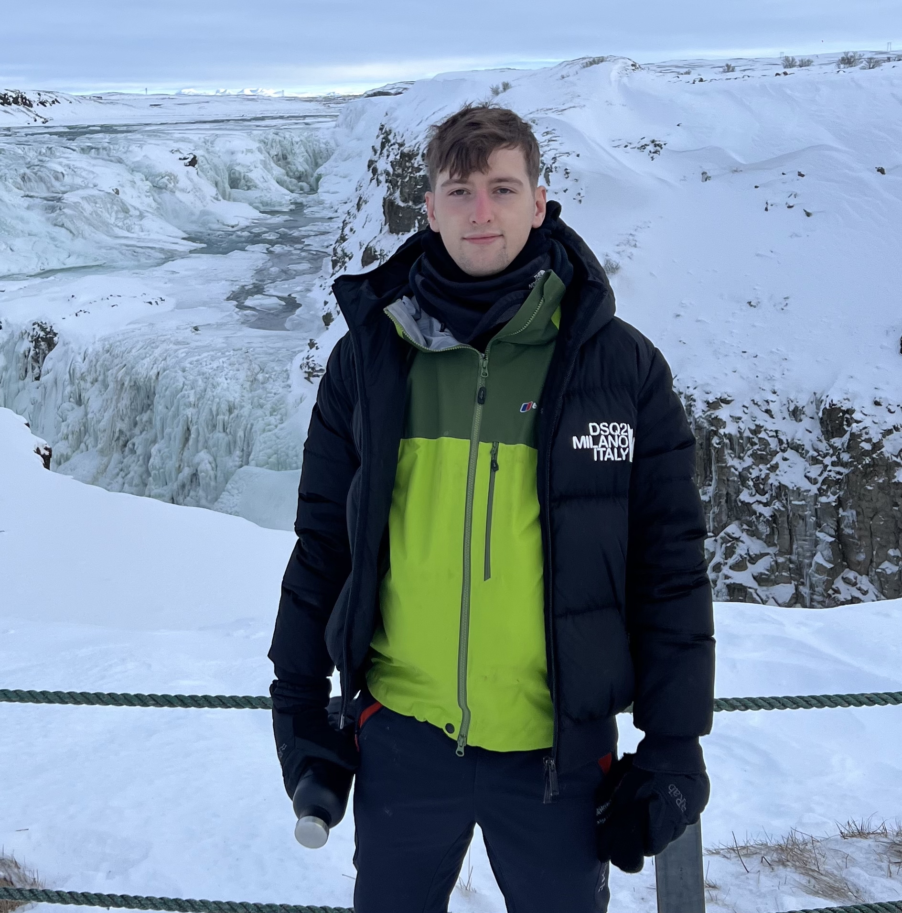

::: {.hero}

# Luke Meredith

PhD researcher in Mathematics at the University of Warwick, working on stochastic systems, Markov chains, opinion dynamics, and social learning.

:::

::: {.text-center}
{width=300px}
:::

## Research

::: {.research-grid}

::: {.research-card}
### Opinion dynamics

Metastability, phase transitions, and mixing in nonlinear models of social interaction.
:::

::: {.research-card}
### Social learning and bandits

How agents can use information from neighbours to improve learning and reduce regret.
:::

:::

## About

My research focuses on how microscopic stochastic interactions give rise to macroscopic collective behaviour. I am particularly interested in mixing times, metastability, mean-field limits, and multi-agent learning.

## Links

[Research](research.qmd) · [Publications](publications.qmd) · [CV](cv.qmd)